# Retail KPIs

Retail KPIs is an app designed for retailers to analyse customer data and calculate store key performance indicators (KPIs). The user is able to update a spreadheet with sales figures, obtain automated figures for KPIs and get a predicted sales target for the next day, based on data collected from previous selling days. This allows the user to automatically update a spreadsheet with data, and obtain KPI results for easy analysis of store performance and customer purchase data.

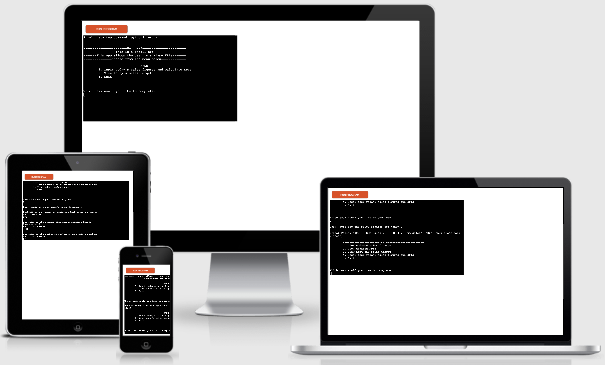

## Application Structure

The image below shows the application structure. This represents how the user will use the app, and the processes they will go through.
The red square always represents a menu, where the user is able to choose what to do from a menu of options. The blue curved shapes show the functions that are being used within the app. Here there are several different functions that are used within the app. Somtimes the same function is used more than once and the order that it is used is shown on the arrows attached to the function. The yellow vertical squares show where the user is required to input a value to be added to the spreadsheet. Green hexagons show where the user is able to view some data. There is a two way arrow attached to these shapes showing that they are able to go back to the menu of options after viewing this. 
Red circles represent where the user has chosen to exit the app. Lines with arrows show that the preceding step is necessary for the current step, where as line with no arrow heads just imply that that is the next step or order of step in the application.

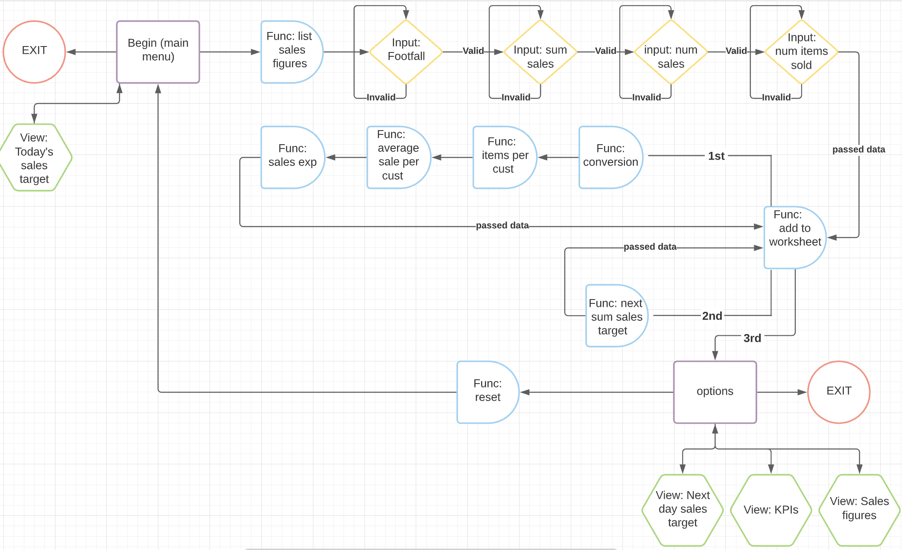

## Database Structure

The structure of the database is shown below. There are three worksheets: sales figures, KPIs and sum sales target. The first worksheet, sales figures, is a worksheet of data that is collected by the user and then submitted to this app. The second worksheet, KPIs, shows the analysis of this data, which is calculated and added to the worksheet by functions, after the sales figures worksheet is updated. Finally, sum sales target is then calculated and updated, showing the sum sales target for the next day. Hence why there is 1 more row for sum sales target than there is for the others. As each row represents a day of business.

### Sales Figures

|Footfall|Sum sales £|Num sales|num items sold|
|---|---|---|---|
|300|40000|80|240|
|340|53000|124|266|
|320|45000|80|240|
|353|52000|75|233|

Footfall is a measure of the number of customers (AKA potential customers) that enter the store. This is usually measure by a doorman, or a device that is able to count as a person enters a store, for example. Sum sales is the revenue that the business makes. So, the total income before any outgoings. Num sales is the number of sales that are made. Num items sold is the total number of items that the business sells for that day.

### KPIs

|Conversion %|IPC|APC £|Sales EXP %|
|---|---|---|---|
|22|2|500|-19|
|24|2|529|-3|
|24|2|515|-15|
|25|3|530|-4.2|
|27|3|529|-3.5|

KPIs are then calculated from the sales figures that are submitted by the user. Conversion is a measure of the number of customers that buy something compared to the number of customers that enter the store. This value is usually measured as a percentage. IPC is the Items per customer, which represents the number of items bought on average per customer. APC is the average sale per customer. This is a measure of the everage transaction value. Sales EXP (or expectation) is a way to compare how far the actual sum sales is from the target. This is also measured as a percentage. If the sum sales is greater than the Next Trg, sales EXP will be positive. And if sum sales is less than Next Trg, sales EXP will be a negative.

### Sum Sales Target

|Next Trg £|
|---|
|42000|
|44000|
|45000|
|46500|
|47200|
|47600|

Sum sales Target or Next Trg is a prediction of the following day of sum sales made by the business. This value is measured by taking an average of the previous 5 days of business. If sum sales begin to increase, the target will be higher, and vice versa if sum sales decrease.

## Features

- - - 
### The first menu

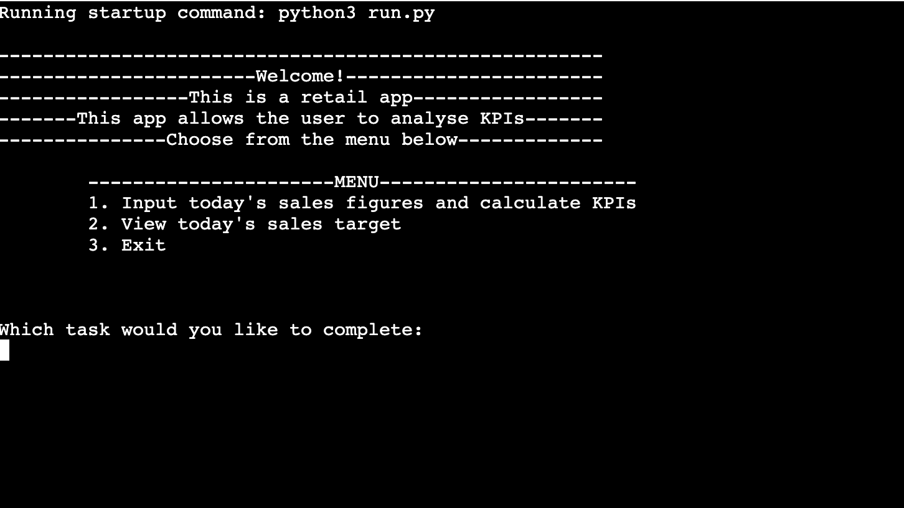

The image above shows the user being welcomed by the app, and then the user is given a set of options to choose from. Of which these options are: Input today's sales figures, View today's sales target and exit.  

- - - 
### View sales target

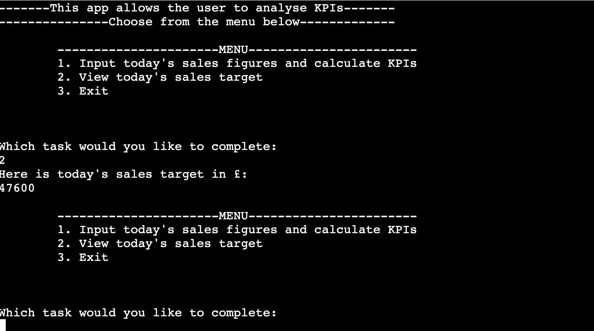

If the user wants to view todays sales target, they would select option 2, and then the app would show the sales target for that day, measured in units £. The user is then shown the menu again and asked to select another task.  

- - - 
### Input today's sales figures

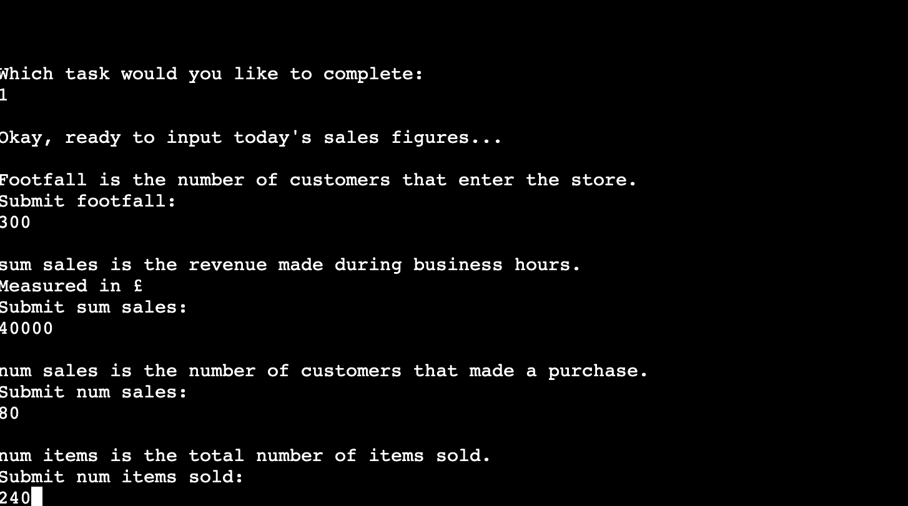

At the end of a selling day, the user would input the sales figures by selecting option 1. The application will ask the user for each input accordingly and give the user an explanation of which input is required and what the units of this measurement is in. This data is then collected, updated on the sales figures worksheet. Following on from this the KPIs and sum sales target worksheets are also updated.  

- - - 
### The second menu 

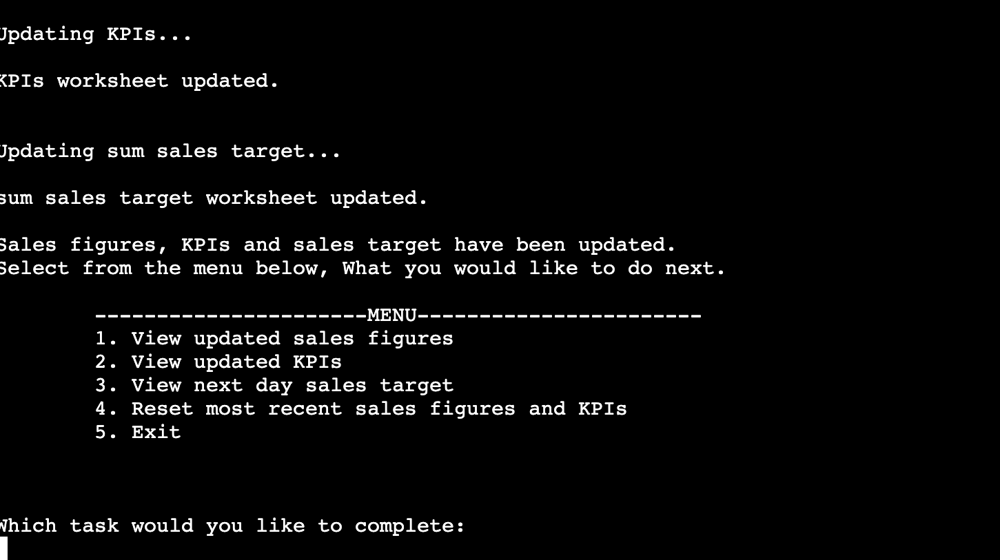

The user is then shown a second menu of options to selct from. This time the user can select from 5 options: View sales figures, View KPIs, View next day sales target, reset most recent sales figures and KPIs or exit.  

- - - 
### Sales figures

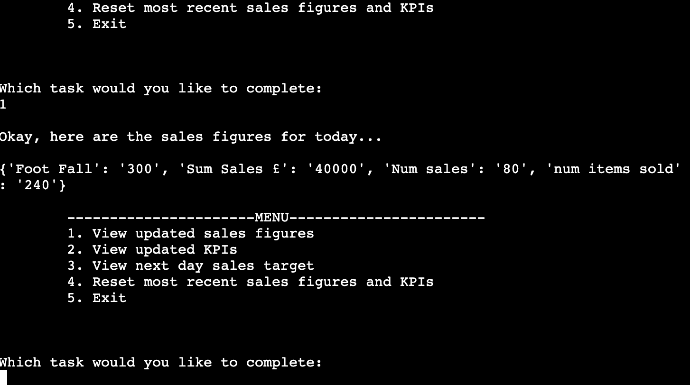

If the user selects to view the submitted sales figures again, the app will bring up a dictionary showing keys as the column headings of the spreadsheet and values as the data submitted by the user. The keys will also hold the units of each of the measurements.  

- - - 
### KPIs

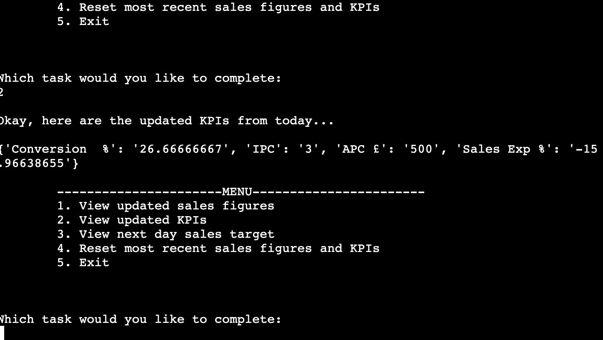

If the user selects to view the KPIs, the user is shown a dictionary of the KPIs calculated by the application. Again, keys show the kind of data, whilst the values show the calculated values.  

- - - 
### Next trg

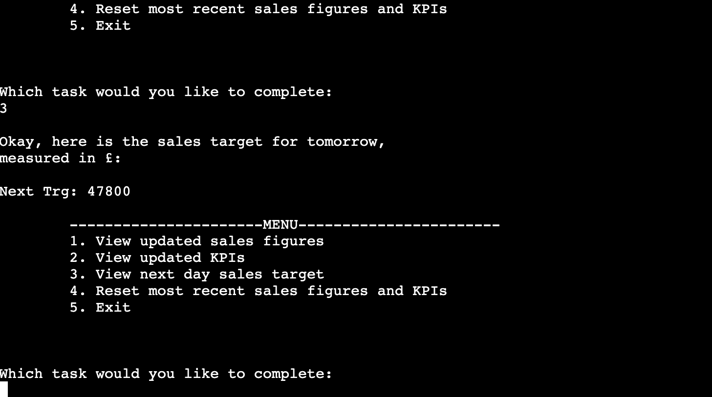

The user can also select to view the next day sales target where the application then shows the predicted value for this to the user, and the units for this calculation.  

- - - 
### Reset

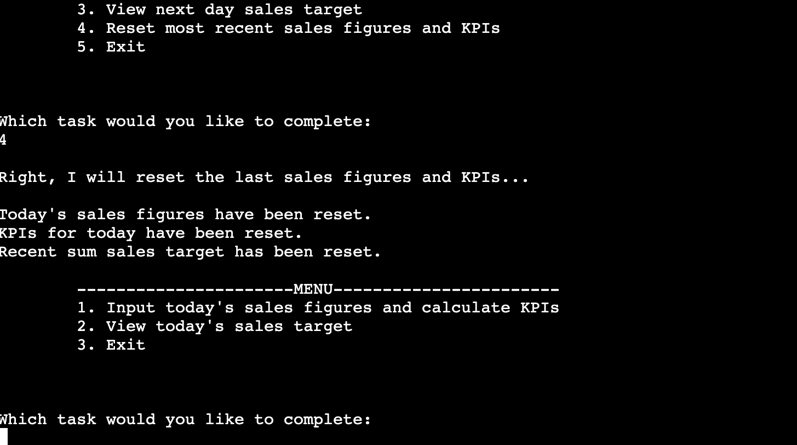

If the user realises that there is a mistake with the submitted data for sales figures. The user is given the option to reset the recently inputted data. This removes the previous row of sales figures data, KPIs and next day sales target. After this option is selected, the user is brought back to a menu with the original 3 options to: input sales figures, view todays sales target or exit.  

- - - 
### Exit

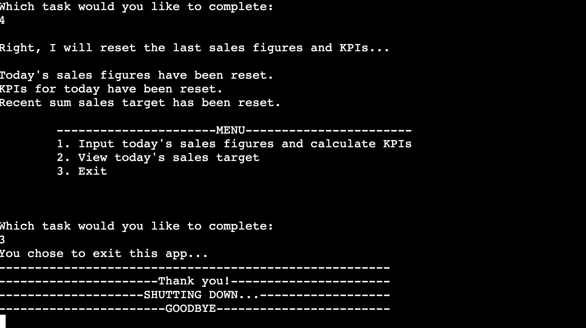

If the user is happy with the sales figures data and calculated KPIs, the user can exit the application and the spreadsheet will remain updated with the new data for the following day of sales. Here the user is told goodbye and the application will shutdown. 

- - - 
### Features to implement

1. To give the user more flixibility in viewing the data from previous selling days
2. Give the user acces wo view previous days of sales figures
3. Give the user the ability to reset older data that was submitted 

## Technologies used

[Python3](https://www.python.org/downloads/) - This entirety of this project was written in python

## Other technologies used

[Gspread](https://docs.gspread.org/en/latest/) - This was used to store and access the database
[Github](https://github.com/) - For adding and accessing the projects and adding repositories
[Gitpod](https://www.gitpod.io/) - This was used for creating and viewing code in the terminal and also pushing to gitpod
[Heroku](https://id.heroku.com/login) - Was used to deploy the application and generating a live link

## Testing

PEP8 Validation - [PEP8](http://pep8online.com/)

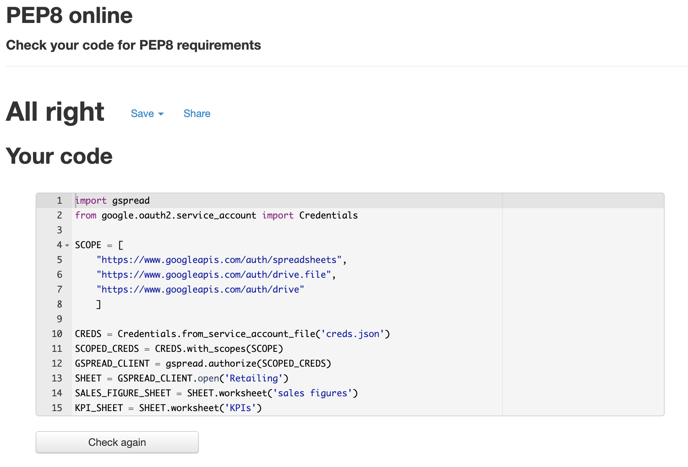

PEP8 was used to check validity of code. I had no code validity errors for my PEP8 validity check.

### Known bugs

My code occasianly had some bugs that required fixing. specifically logic errors. This code is math heavy and required a lot of research and understanding to analyse the data. I fixed the bugs that I encountered by writing out, on paper the mathematical processes used in the application.
Also, the were some coding bugs that required fixing. I used prints statements at various points during code to check that the code was executed correctly.

- The calculations used for predicting the next day sum sales target was quite difficult to reproduce. To fix this I had to create a simplified model of this equation by doing research on the most important factors to be considered.
- There were also some coding errors when trying to create the reset function. It was difficult to know which collumns of the worksheets were being selected, and which values had to be removed. Using print statements to know exactly which values are selected, I knew which values from the spreadhseet to delete.

### Remaining bugs

There are no known remaining bugs in application.

## Deployment

I deployed this project using Heroku - [Retailing KPIs](https://retail-kpis.herokuapp.com/)

### Deployment procedure

- After creating an account with Heroku,
- select 'Create new App' icon,
- name the project with a unique name and choose the region,
- select the 'Create' icon.
- Then go to the settings tab,
- add the 'Convig vars':
    1. CREDS as the key and then copy the contents of the creds.json file into the value section
    2. PORT as the second key and '8000' as the corresponding value if using the template provided for this application
- Then select the 'Add Buildpack' icon, 
    1. select 'Python' and save changes
    2. Select 'Node JS' and save changes 
- 'Python' must come before 'Node JS'. If this is not in order, you can select and drag 'Python' to be before 'Node JS'.
- Select the Deploy tab,
- Choose Github as the deployment method and confirm that you wish to connect to a repository,
- Enter the name of the repository, and select the matching repo.
- Finally, choose the deployment method. I selected automatic, just because I wanted automatic deployments of my application everytime I pushed my updated code to Github.

## Credits

All code was written by the myself ([Reece Thatcher](https://github.com/reececilon))

## Acknowledgements

Richard Wells - My CI mentor